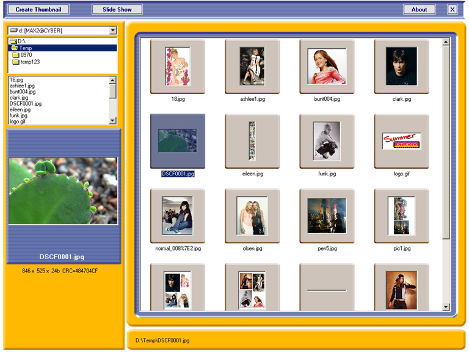



## A XPThumbnails

### Description

Xpress Thumbnails Viewer (plus Image Viewer / slideshow). Auto create thumbnails. Use PropertyBag to save and load ImageList and ListView data. Compute CRC picture files.
 
### More Info
 
Only for VB6 with SP6 version.

             |
---                |---
**Submitted On**   |2005-02-22 17:39:36
**By**             |[Tmax](https://github.com/Planet-Source-Code/PSCIndex/blob/master/ByAuthor/tmax.md)
**Level**          |Advanced
**User Rating**    |4.8 (164 globes from 34 users)
**Compatibility**  |VB 6\.0
**Category**       |[Miscellaneous](https://github.com/Planet-Source-Code/PSCIndex/blob/master/ByCategory/miscellaneous__1-1.md)
**World**          |[Visual Basic](https://github.com/Planet-Source-Code/PSCIndex/blob/master/ByWorld/visual-basic.md)
**Archive File**   |[XPThumbnai1856372222005\.zip](https://github.com/Planet-Source-Code/tmax-a-xpthumbnails__1-59091/archive/master.zip)

